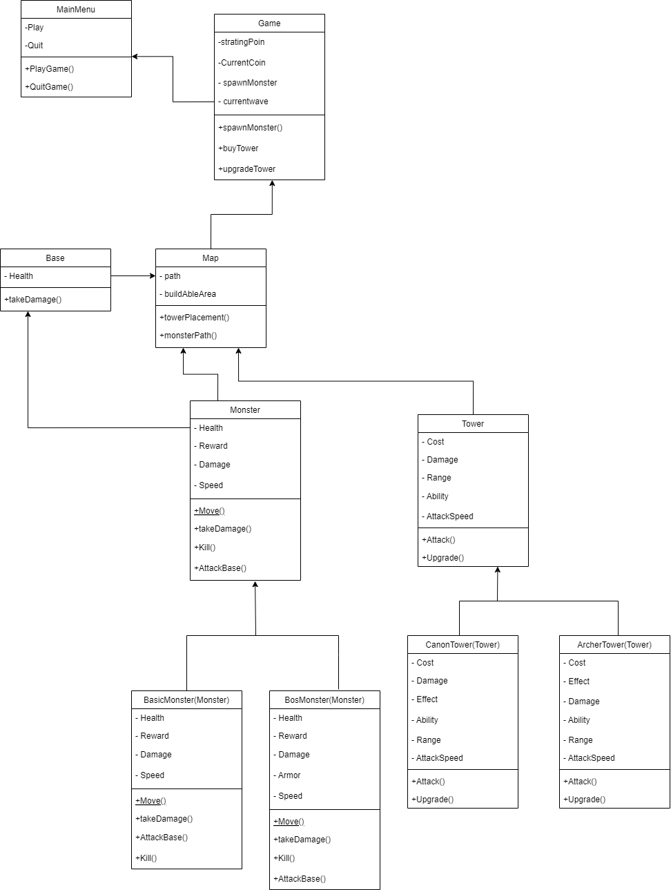
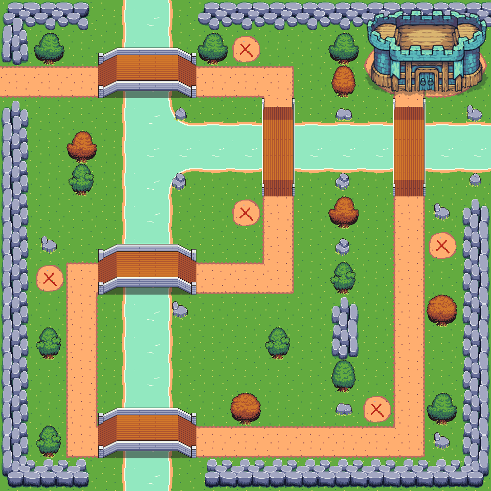

# Sentinel Siege
Sentinel Siege adalah permainan Tower Defense Game yang memiliki tema Medieval dan menggunakan Pixel Art agar lebih mudah di jalankan di laptop kentang


## Kelompok OkSobatKoding

- [@Jhoel Robert](https://github.com/Arkyna)

- [@Alwi Arfan Solin](https://github.com/samanbrembo14)

- [@Eric Arwido Damanik](https://github.com/erc-a)

- [@Lucas Hamonangan Simare-Mare](https://github.com/LucasHamonangan412)

- [@Dyo Dwi Carol](https://github.com/Dyocarol)

- [@Afif Malik Azhar](https://github.com/AfifMalikAzhar)


## How To Play
- Pada awal permainan, pemain akan diberikan jumlah gold tertentu untuk membeli tower 

- Bunuh Monster agar mendapatkan gold dalam jumlah tertentu

- Ketika gold sudah cukup, beli tower atau upgrade tower yang sudah ada agar musuh lebih mudah di Bunuh

- Base memiliki HP (Healt Point)

- Ketika monster sudah mencapai base, maka HP base akan berkurang

- ketika sudah mencapai waktu tertentu, boss monster akan datang untuk menyerang base

- ketika boss dikalahkan maka permainan berakhir dan game selesai

- Jika HP base sudah mencapai 0 maka permainan berakhir dan pemain kalah


## Depedency

```bash
  Python : 3.8.X
  Pygames: 2.5.2
```


## Installation

Untuk Menjalankan project, install python ke dalam laptop atau computer anda dan ketika sudah terinstall, buka terminal yang anda pakai dan gunakan perintah

### For Windows
```bash
  pip install pygame
```
### For Mac
```bash
  pip3 install pygame
```

### For Linux
```bash
  sudo apt-get install python3-pygame
```
    
## UML Class Sentinel Siege


## Screenshot Game 


### Screenshot Map


### Screenshot Tower


### Screenshot Monster


## Contributors


| Nama |  NIM     | Kontribusi                |
| :-------- | :------- | :------------------------- |
| Alwi Arfan Solin | 122140197 | Asset Search, Programming Asset |
| Jhoel Robert Hutagalung | 122140174 |Main Programmer  |
| Eric Arwido Damanik | 122140157 |Lead Project, Second Programmer   |
| Lucas Hamonangan Simaremare | 122140196 |  |
| Dyo Dwi Carol Bukit | 122140 |  |
| Afif Malik Azhar | 121140 |  |

## Reference

