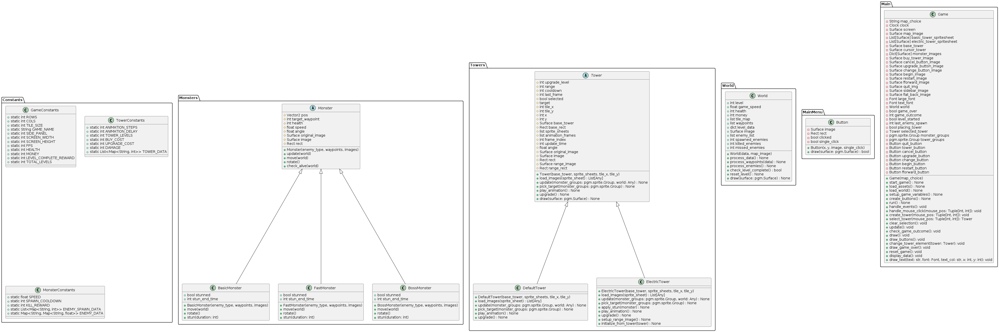
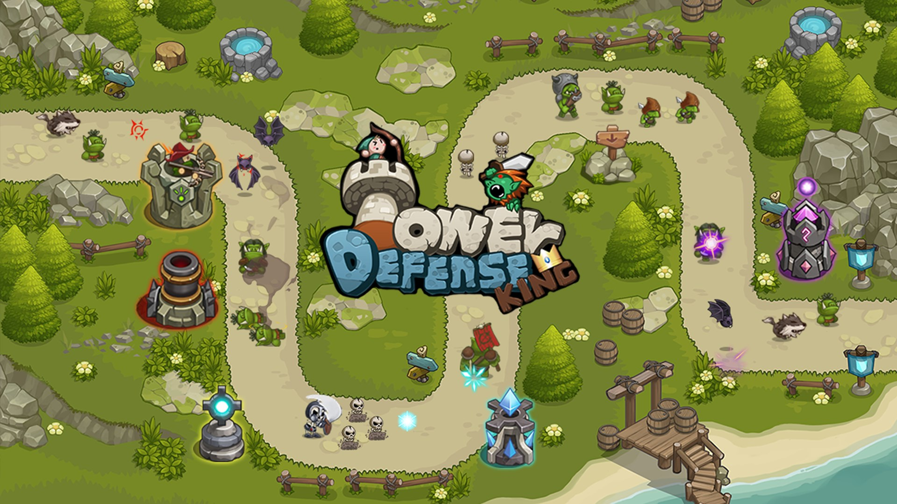

# Sentinel Siege
Sentinel siege adalah permainan tower defense yang termasuk dalam kategori game strategi yang bertujuan untuk membangun tower untuk mengalahkan monster yang berusaha menembus masuk base utama.Tugas kita adalah membangun barisan pertahanan yang tak tergoyahkan. Perkuat menara-menara tangguh, pilih strategi yang cerdas, dan hentikan para monster sebelum mereka menghancurkan base.
Sentinel Siege adalah permainan Tower Defense Game yang memiliki tema Medieval


## Kelompok OkSobatKoding

- [@Jhoel Robert](https://github.com/Arkyna)

- [@Alwi Arfan Solin](https://github.com/samanbrembo14)

- [@Eric Arwido Damanik](https://github.com/erc-a)

- [@Lucas Hamonangan Simare-Mare](https://github.com/LucasHamonangan412)

- [@Dyo Dwi Carol](https://github.com/Dyocarol)

- [@Afif Malik Azhar](https://github.com/AfifMalikAzhar)


## How To Play
- Pada awal permainan, pemain akan diberikan jumlah gold tertentu untuk membeli tower 

- Bunuh Monster agar mendapatkan gold dalam jumlah tertentu

- Ketika gold sudah cukup, beli tower atau upgrade tower yang sudah ada agar musuh lebih mudah di Bunuh

- Base memiliki HP (Healt Point)

- Ketika monster sudah mencapai base, maka HP base akan berkurang

- Ada beberapa jenis monster yang dispawn

- ketika semua monster dikalahkan maka permainan berakhir dan game selesai

- Jika HP base sudah mencapai 0 maka permainan berakhir dan pemain kalah


## Depedency

```bash
  Python v3.8.X
  Pygames v2.5.2
```


## Installation

Untuk Menjalankan project, install python ke dalam laptop atau computer anda dan ketika sudah terinstall, buka terminal yang anda pakai dan gunakan perintah

### For Windows
```bash
  pip install pygame
```
### For Mac
```bash
  pip3 install pygame
```

### For Linux
```bash
  sudo apt-get install python3-pygame
```

Dan silahkan menjalankan file main_menu.py
    
## UML Class Sentinel Siege


## Screenshot Game 
.png)


## Contributors


| Nama |  NIM     | Kontribusi                |
| :-------- | :------- | :------------------------- |
| Alwi Arfan Solin | 122140197 | Asset Search, Programmer |
| Jhoel Robert Hutagalung | 122140174 | Programmer  |
| Eric Arwido Damanik | 122140157 | Project Leader,  Programmer   |
| Lucas Hamonangan Simaremare | 122140196 | Programmer |
| Dyo Dwi Carol Bukit | 122140145  | Programmer |
| Afif Malik Azhar | 120140117 | Programmer |

## Reference
Game : Tower Defense King

